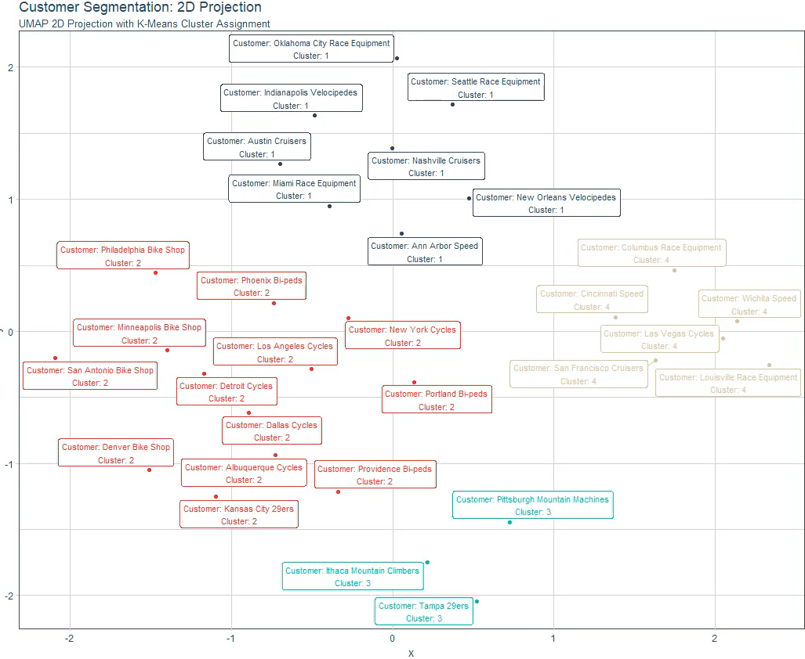

# Customer-Segmentation-Trend-Analysis-with-K-Means-Clustering-UMAP
Analyzed customer trends and created a user-item matrix by aggregating quantity purchased by cluster and product attributes. Normalized data and used a K-Means Scree Plot and UMAP (high performing dimensional reduction) to visualize customer segments. Implemented interactivity to enable exploration of the data.

